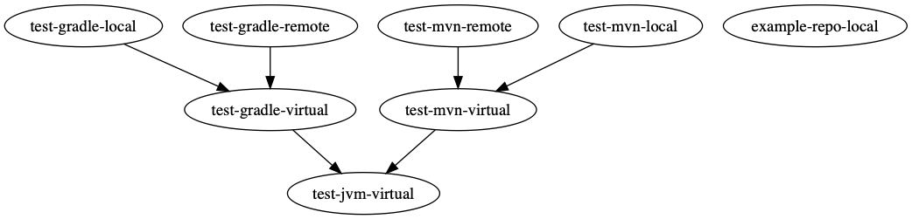

# Artviz

[](https://circleci.com/gh/willis7/artviz)

_**Requires Artifactory Pro**_

This simple CLI connects to your artifactory instance using the REST API 
and generates a graphviz representation using the DOT language.

```
Usage:
  artviz [URL] [flags]

Flags:
  -k, --apiKey string   Artifactory API Key
  -h, --help            help for artviz
      --version         version for artviz
```

## Development

To support local development a `docker-compose.yml` has been provided. However, you will need to have a licenced version to work. The best option is to apply for an evaluation licence and apply it to your development instance.

Spin up a local instance of Artifactory using

    make compose-up

You will need to apply for an evaluation token. Enter that now.

Access the application on:
    
    localhost:8081

login with `un/password`

    admin/password


Get list of repos:

    $ curl http://localhost/artifactory/api/repositories


## Example usage

Download the release from [Github Releases](https://github.com/willis7/artviz/releases). You may wish to rename the binary to remove the OS and architecture from the name `mv darwin_amd64_artviz artviz`. The examples below assume you have renamed:

Example raw output:

    $ artviz http://localhost:8081/artifactory --apiKey xxsecretxx

    digraph Artifactory {
        "test-gradle-local"->"test-gradle-virtual";
        "test-gradle-remote"->"test-gradle-virtual";
        "test-gradle-virtual"->"test-jvm-virtual";
        "test-mvn-virtual"->"test-jvm-virtual";
        "test-mvn-remote"->"test-mvn-virtual";
        "test-mvn-local"->"test-mvn-virtual";
        "example-repo-local";
        "test-gradle-local";
        "test-gradle-remote";
        "test-gradle-virtual";
        "test-jvm-virtual";
        "test-mvn-local";
        "test-mvn-remote";
        "test-mvn-virtual";

    }

Pass the output to Graphviz:

    $ artviz http://localhost:8081/artifactory --apiKey xxsecretxx | dot -Tpng > artifactory.png  

